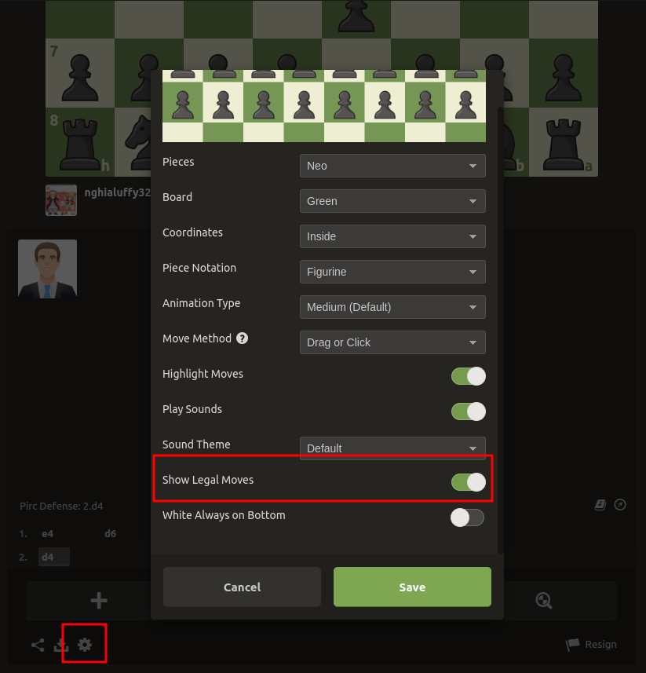
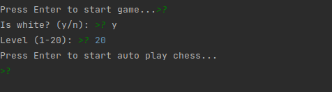

# CHESS BOT

## Description
This is a chess bot that uses stockfish and selenium to autoplay in chess.com. This bot is for educational purposes only.

## Requirements
- Python 3.8.3
- Selenium 3.141.0
- Stockfish 12
- ChromeDriver 86.0.4240.22

## Usage
- Clone this repository
- Install the requirements (`pip install -r requirements.txt`)
- Run the script (`sudo sh ./install_chromedriver.sh`)
- Run file main.py (`python main.py`)
- Enjoy

## Notes
- The bot is not perfect, it can make mistakes
- Remember show the legal moves before playing

